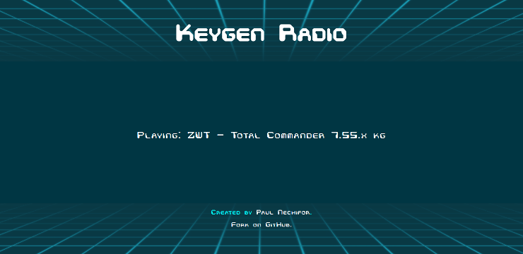

# Keygen Radio

Listen endlessly to keygen chiptunes in JS. This is the source code for [Keygen
Radio][kgradio].

## Usage

To make it work, you need some chiptunes. You can download (and process) the
archive from [keygenmusic.org][kgmusic] by running:

    ./scripts/download-music-pack

Install the requirements:

    yarn

Build everything with:

    yarn build

Everything that’s required will be built in `./dist`. Start a static server that
will serve it with:

    yarn start

## Acknowledgements

This uses [chiplib][chiplib], my fork of Simon Gündling’s
[chiptune2][chiptune2]. It uses Emscripten to transpile [libopenmpt][libopenmpt]
into JavaScript.

## TODO

- Add a modal for more info on the homepage.
- Fix next and pause controls.

## License

GPL v2

[kgradio]: http://keygenradio.com
[kgmusic]: http://keygenmusic.org
[chiplib]: https://github.com/paul-nechifor/chiplib
[chiptune2]: https://github.com/deskjet/chiptune2.js
[libopenmpt]: http://lib.openmpt.org/libopenmpt
